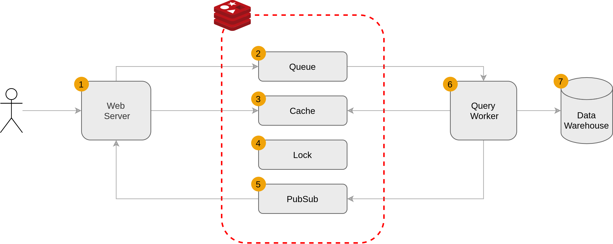

## Architecture diagram

## Tags
`multi-tenancy` `subsecond queries` `redis`

## WarmUp
Dataroam Query AP is a marketing intelligence platform that groups in one place (ie., data warehouse) all the marketing data of a customer (facebook, google, twetter, email,..) and allows subsecond querying performance. As per the time this video is made, they processe 5B records processed daily wiht 3.5 million queries and 40k redis calls per second. 

## Components
1. Webserver
2. Redis Queue:	
	- Holds messages with unique id's and query statemen as data.
3. Redis Cache
	- Holds a map `<query-hash, quer-result>` of all previously executed queries.
4. Redis Lock
	- Since the application is multi-tenant, each customer gets assigned a semaphore with e certain size (eg., 10). This means that the customer can run 10 concurrent queries.
5. Redis Streams (PubSub)
	- As soon as te query worker completes processing the query, it publishes the result in a pubsub topic. The webserver is subscribed to this topic, receives the result and shows it to the user.
6. Query Worker	
7. Data Warehouse

## Data Movement
- A request comes to the webserver (eg., I want to get all the clicks, views, impression, convnersions, by campaign, accross google facebook, tweeter, groupped by country, city etc.)
- The query is hashed. In Redis Cache, there is a map of pre-executed queries and results. If there is a `hit`, the result is returned to the user. This improves in `speed` and `less computation`.
- If there is a cache miss, wrap the query in a message, and assign to it a unique identifie and push it to the queue. The worker then consumes the message. This benefits in `decentralisation` and `auto-scaling`.
- Once the query worker has consumed a message and is about to perform the query with the data warehouse, first a `lock` is acquired in Redis. This benefits in terms of:
	- Resilience: we don't want to thrash the data warehouse with tons of concurrent queries.
	- No "Noisy neighbors": Sine this is a multi-tenant architecture, (all the customer's data is stored in the same data infrsastructure), we want to avoid the situation when a customer sends multiple resources concurrently and starves the other customers. Locks are per customer basis. In this case, a semaphore with a certain size is assigned to each customer. If acquiring the lock fails, the message is sent back to the queue with a certain delay assigned to it. This ehances the congestion management.
- Once the query is performed by the worker, we want to sent the response back to the customer. First the response is put in the cache. The response is published to a pubsub topic where the webserver is subscribed. This achieves a coordination between teh webserver nad the query worker on a query which id was stored in the message stored previously in the queue. This allos immediate feedback to the web server.

## References
- [5 Redis Use Cases with Gur Dotan - Redis Labs](https://www.youtube.com/watch?v=znjGckK8abw&ab_channel=Redis)
